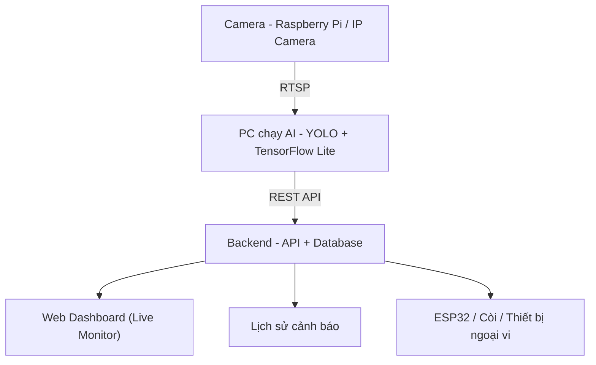

# 🚗 Edge AI Driver Monitoring System (DMS)

Hệ thống **giám sát tài xế thời gian thực** chạy AI tại biên (Edge AI).  
Hệ thống nhận video từ camera qua **RTSP**, chạy mô hình **YOLO tối ưu bằng TensorFlow Lite** trên máy tính, sau đó gửi trạng thái và cảnh báo đến backend để hiển thị dashboard và kích hoạt thiết bị ngoại vi (loa, còi, ESP32).

# 📌 Tổng Quan

Hệ thống gồm 4 thành phần chính:

- **Camera (Raspberry Pi / IP Camera)**  
  Phát luồng video qua giao thức **RTSP**.

- **PC chạy AI (Edge Node)**  
  - Nhận luồng RTSP  
  - Chạy mô hình phát hiện hành vi tài xế  
  - Quyết định khi nào phát cảnh báo  
  - Gửi dữ liệu lên backend  

- **Backend (API + Database)**  
  - Nhận trạng thái và cảnh báo  
  - Lưu lịch sử  
  - Cung cấp dashboard theo dõi trực tiếp  
  - Đồng bộ cấu hình về client  

- **Thiết bị ngoại vi (ESP32 / Còi / Loa)**  
  - Nhận tín hiệu cảnh báo  
  - Phát âm thanh hoặc kích hoạt báo động  

Phù hợp cho:
- Đồ án tốt nghiệp
- Demo hệ thống an toàn lái xe
- Mở rộng thành hệ thống giám sát fleet

# ✨ Tính Năng Chính

## 🎥 Xử lý video RTSP
- Nhận luồng từ Raspberry Pi / IP camera
- Xử lý khung hình liên tục
- Độ trễ thấp

## 🧠 Phát hiện hành vi tài xế (Real-time)
- Tỉnh táo
- Buồn ngủ
- Dùng điện thoại
- Gọi điện
- Quay đầu

## 🚨 Cảnh báo thông minh
- Cấu hình thời gian giữ cảnh báo riêng cho từng hành vi
- Cooldown riêng cho từng loại
- Bật/tắt từng cảnh báo
- Đồng bộ cấu hình từ backend định kỳ

## 🔊 Âm thanh cảnh báo (TTS tiếng Việt)
- Tự động tạo câu nhắc bằng TTS
- Phục vụ file âm thanh qua HTTP
- Backend hoặc app có thể mở URL để phát

## 🖼 Ảnh chụp khi cảnh báo
- Lưu ảnh đã vẽ bounding box
- Gửi link ảnh về backend
- Hiển thị trên dashboard

## 📡 Live Preview
- Gửi trạng thái hiện tại
- Gửi khung hình lên backend để theo dõi trực tiếp
- 
# 🏗 Kiến Trúc Hệ Thống

### Luồng dữ liệu

1. Camera phát RTSP → PC nhận luồng
2. PC chạy inference → gửi trạng thái & cảnh báo
3. Backend:
   - Lưu lịch sử
   - Cập nhật dashboard
   - push tín hiệu tới ESP32
# ⚙️ Yêu Cầu Hệ Thống
## Python
- Python >= 3.9
## Thư viện
- OpenCV
- NumPy
- TensorFlow hoặc TensorFlow Lite
- Requests
- gTTS
## Khác
- File mô hình `.tflite` (YOLO đã convert)
- Backend có API:
  - Lấy cấu hình
  - Nhận live state
  - Nhận cảnh báo
Ví dụ backend: `FastAPI + MongoDB`

## 🔁 Cấu hình nâng cao
Các thông số sau được backend trả về qua API và tự động đồng bộ:
- Thời gian giữ cảnh báo
- Thời gian cooldown
- Bật/tắt từng loại hành vi
- Bật/tắt còi
- Các tham số khác
 
## 🧩 Công Nghệ Sử Dụng
- Video Streaming: RTSP, OpenCV
- AI Model: YOLO
- Optimization: TensorFlow Lite (Quantization / Pruning)
- Backend: FastAPI + MongoDB
- Frontend: ReactJS
- IoT: Raspberry Pi 3B, ESP32, WebSocket 

## 📊 Ứng Dụng Thực Tế
Hệ thống giám sát tài xế xe tải
Giám sát tài xế taxi / xe công nghệ
Nghiên cứu hành vi người lái
Hệ thống an toàn giao thông thông minh

## 📜 License
Dự án phục vụ mục đích học tập và nghiên cứu.
Vui lòng liên hệ tác giả trước khi:
Sử dụng cho mục đích thương mại
Triển khai sản phẩm thực tế
Phát hành lại mã nguồn
